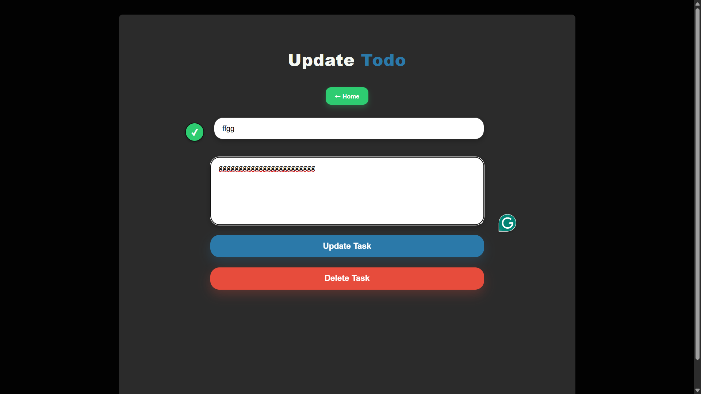

# Todo App

This is a **full-stack Todo application** built with **Next.js** for the frontend and a **Node/Express backend**. Users can add, update, and view tasks with status tracking.

---

## Features

- Add, update, and delete tasks  
- Track task status: `Complete` or `Incomplete`  
- Optional task descriptions  
- Frontend built with Next.js (App Router)  
- Responsive design

---

## Tech Stack

- **Frontend:** Next.js 15+, TypeScript, React  
- **Backend:** Node.js / Express  
- **Hosting:** Vercel (frontend), backend can run locally

---

## Project Structure

```
project-root/
├─ src/
│  ├─ app/              
│  │  ├─ add-task/
│  │  ├─ update-task/
│  │  └─ components/
│  └─ types/             
├─ server/               
├─ package.json
├─ tsconfig.json
└─ README.md
```

---

## Screenshots

**Homepage / Task List**  


**Add Task Page**  


**Update Task Page**  



## Getting Started

### 1. Clone the repository

```bash
git clone https://github.com/Karrycoder007/todo-app-task-.git
cd todo-app-task-
```

### 2. Install dependencies

```bash
npm install
# or yarn
```

### 3. Run development server

```bash
npm run dev
```

Open [http://localhost:3000](http://localhost:3000)

---

### 4. Running Backend

```bash
cd server
npm install
npm run dev
```

> Set your **MongoDB URI** in `.env` file

---

## Build for Production

```bash
npm run build
npm start
```

---


---


## Learn More

- [Next.js Documentation](https://nextjs.org/docs)  
- [Vercel Deployment Docs](https://nextjs.org/docs/app/building-your-application/deploying)

---

## Contributing

1. Fork the repo  
2. Create a new branch  
3. Make changes  
4. Commit & push  
5. Open a pull request

---

## License

MIT
